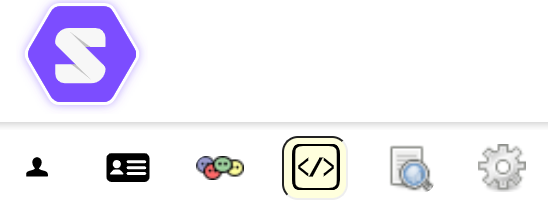
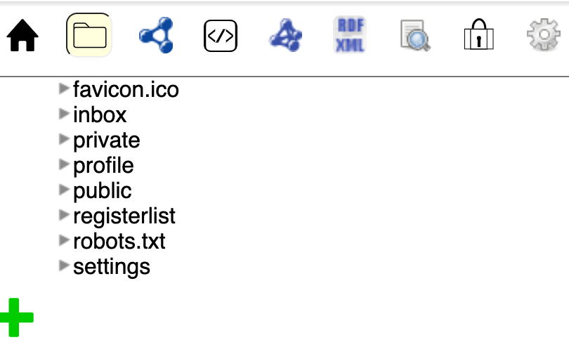
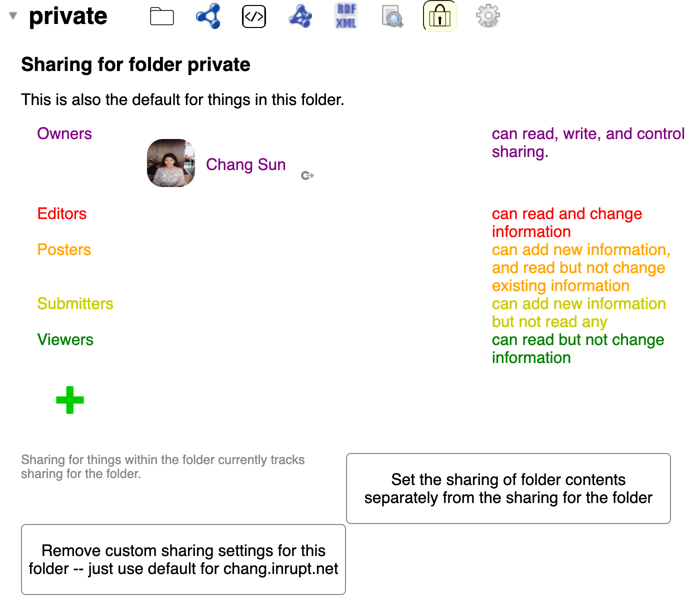
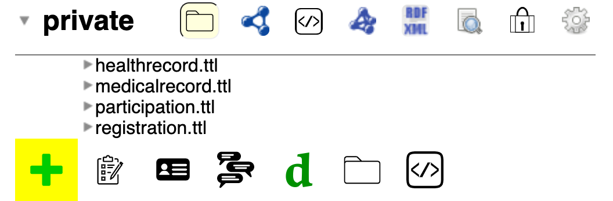
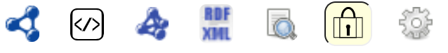
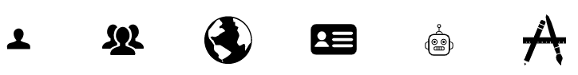

# Hello, SOLID

This repository gives a brief SOLID tutorial presented in IDS Training Day 2020 on 25-11-2020. 

Editor: [Chang Sun](chang.sun@maastrichtuniversity.nl)

Abstract: This repository contains the slides,  a tutorial, and some resources about personal data vaults and SOLID in particular. This is for the internal training program at Institute of Data Science at Maastricht University. The SOLID training session has 20 mins presentation, 20 mins hands-on, and 15 mins discussion. Please feel free to [contact me](chang.sun@maastrichtuniversity.nl) if you have any questions. 

***
### Table of Content ###
1. S1 - Presentation  
2. S2 - Create your own SOLID account
3. S2 - Explore the your SOLID pod
4. S2 - Check the access control of different folders
5. S2 - Create a new file and edit existing files in Public folder
6. S2 - Create a new file in Private folder
7. S2 - Try the different access control of the file and folder
8. S3 - Group PBL on SOLID pods
9. Resources

***

### S1 - Presentation  ###

You can find the presentation slides from this [link](CSUN_trainingDay2020_SOLID.pdf). You are very welcome to give feedback and comments. 

***

### S2 - Create your own SOLID account ###

The step to enter SOLID world is to create a valid SOLID account (as always :)) which contains your **data pod** and your unique **WebID**. **Pod providers** are the places where you can create a SOLID account. The pod providers can be any party who host a server where your data pod is "physically" living. 

- Check [here](https://solidproject.org//users/get-a-pod) to find which public pod providers are available, look at who is hosting the pods, and where your data is acutually located. Then choose your favorite pod provider for now. 

- Go to one of the pod provider, click "Register", fill the form. 

- ** External WebID:

  - If this is your first SOLID account, skip this checkbox.
  - If you already have a WebID, you can use the existing WebID to create a new pod from any pod providers. 

- .Your public SOLID Pod URL will be: `https://xxxyyyzzz.solidweb.org` This is the homepage for your SOLID pod. By default, it is readable by the public, but you can always change by changing the access control.

  Your public SOLID WebID will be: `https://xxxyyyzzz.solidweb.org/profile/card#me` This SOLID WebID is your globally unique name that you can use to identify and authenticate yourself with other PODs across the world.

***

### S2 - Explore the your SOLID pod ###

- ** Solid servers offer Linked Data-aware storage, aimed at *machines*, so that this data can be used in applications. Node Solid Server goes a step further, and offers *human-readable* access to data in pods. It does this using [*mashlib*](https://github.com/linkeddata/mashlib), a client-side data mashup library that is compatible with Solid. 
- Let's start with completing your profile. Click right top profile button -> Show your profile. Or you can go to your WebID URL directly e.g., http://chang.inrupt.net/profile/card#me
- Try to click these icons: 
  - Profile and Person: A profile viewer, and editor for basic information
  - Friends: A friends editor.
  - XML Source: A raw Turtle-based editor.
  - About: A human-readable version of all RDF in your profile.
  - Under the hood: Delete the file
- Preferences setting: click right top profile button -> preference
  - User types
    - Power user
    - Developer
  - Manage your trusted applications
    - Give access permission to other people/applications
  - Delete your account
- Explore the storage (folders) 
  - Go to your pod homepage (https://chang.inrupt.net)
  - You see a list of folders 
  - Extend any folder, then have a look what these icons are used for.

***

### S2 - Check the access control of different folders ###

- 
- These permissions are handled using `<filename>.acl` (access control list) files, which follow the [WAC specification](http://solid.github.io/web-access-control-spec/). In summary, WAC allows agents (referred by WebID) to be linked to certain [modes of access](http://solid.github.io/web-access-control-spec/#modes-of-access). At the time of writing, WAC supports the following modes:
  - Read: HTTP `GET` and `HEAD` requests.
  - Write: HTTP `PUT`, `POST`, `PATCH` and `DELETE` requests.
  - Append: Append-only variant of *Write*.
  - Control: Read and Write permissions to the `.acl` file itself.

***

### S2 - Create a new file and edit existing files in Public folder and private folder ###

- The green "**+**" is obviously a button to create a new file :D 
- 
- So far, you can create:
  - Tracker
  - Address book
  - Long chat
  - Dokieli document
  - Folder
  - Source (e.g., Text, Turtle, JSON, RDF, ShEx and SHACL shapes, etc.)
- when you name the file, just avoid using space, big capical letter, underscore, etc. Why? Try it yourself :)))))

***

### S2 - Try the different access control of the file and folder ###

- Go to a file -> Click the sharing icon 
- You can give Person, Group, Everyone, Loggin person, Software agent, Web App.
- Try it by yourself ;)

***

### S3 - Group PBL on SOLID pods ###

***

### Resources ###

For SOLID Beginer (Or User level)

- 
- [Tutorial-Solid-Getting-Started](https://github.com/comunica/Tutorial-Solid-Getting-Started/wiki/Tutorial-walkthrough) from Comunica
- [Getting Started](https://solidproject.org//developers/tutorials/getting-started) from Solid Project
- [Introduction to Linked Data](https://solid.inrupt.com/docs/intro-to-linked-data) if you wanna learn Semantic Web/Linked Data/Resource Description Framework (RDF) 
- [Data Brower User Guide][https://github.com/solid/userguide]
- [Existing SOLID Apps](https://solidproject.org/use-solid/apps)

For advanced level (Or Developer Level)

- [Solid Specification Draft](https://github.com/solid/solid-spec)
- [Run a Solid Server using NodeJS](https://solid.inrupt.com/docs/installing-running-nss)
- [Solid-Server in Node](https://github.com/solid/node-solid-server)
- [Tripledoc](https://vincenttunru.gitlab.io/tripledoc/) for building your own SOLID application
- [SOLID React components](https://solid.github.io/react-components/)
- [SOLID App with React (well-documented)](https://solid.inrupt.com/docs/writing-solid-apps-with-react)
- [SOLID using the Angular framework](https://solid.inrupt.com/docs/writing-solid-apps-with-angular)

Additional material for people who wants to build a SOLID application but no experience in Web App Development and Javascript:

- If you are like me who don't have any experiment with Web App, Javascript, npm, webpack, I would suggest learning some knowledge about **Javascript** first. I followed two tutorial videos:
  - Javascript for beginner](https://www.youtube.com/watch?v=PkZNo7MFNFg)
  - Javascript project tutorial](https://www.youtube.com/watch?v=c5SIG7Ie0dM&t=4730s)

- Then, I would suggest you learn how to use **npm** and **webpack**:
  - npm , [Tutorial](https://github.com/workshopper/how-to-npm), [Crash course](https://www.youtube.com/watch?v=jHDhaSSKmB0), [Installation](https://www.npmjs.com/get-npm)
  - webpack [Get started](https://webpack.js.org/guides/getting-started/), [Installation](https://webpack.js.org/guides/installation/)
- If you have experience with Javascript, npm, and webpack, you can follow this official tutorial directly from SOLID [Write a SOLID application](https://solidproject.org/for-developers/apps/first-app).# solidtrainingday
